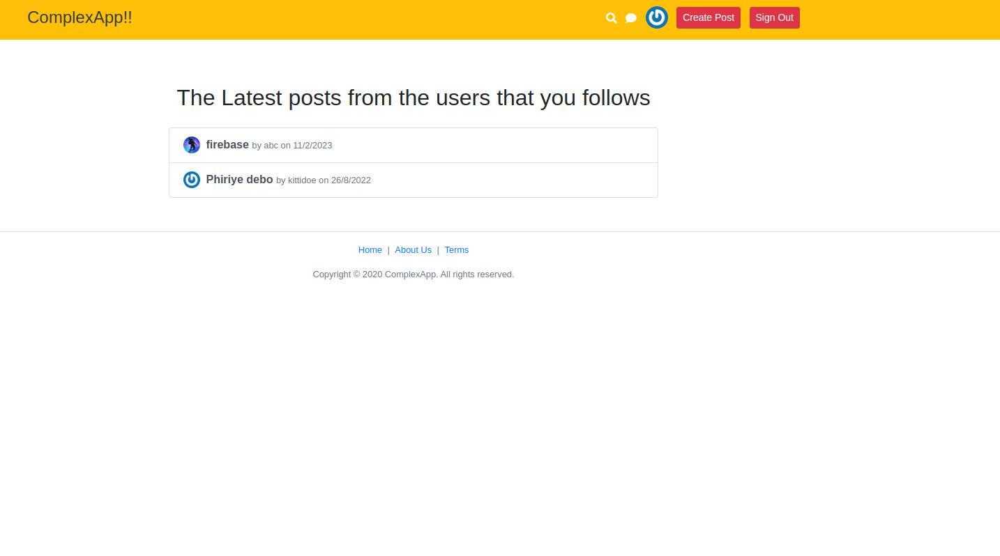

# Memobook




Welcome to Social Meadia App, a stunning and user-friendly social media platform designed to enhance your online experience. Built with cutting-edge technologies like React.js(FrontEnd) and Node.js(BackEnd), Social Media App offers a delightful way to connect, share, and interact with others. Here's a closer look at some of our outstanding features:

## Features

📝**Create Beautiful Posts**
Unleash your creativity by crafting captivating blogs and sharing them with the world. BeautiShare allows you to effortlessly create posts, complete with eye-catching titles. Express yourself and leave a lasting impression with every post you share.

🌟 **Follow Your Passions**
Connect with like-minded individuals and expand your social network. App's "Following" feature lets you follow other users whose content resonates with you. Stay updated with their latest posts and engage with their ideas and interests.

💬 **Seamless Chatting**
Engage in meaningful conversations with friends and fellow users through our intuitive chat feature. Whether you're sharing ideas, making plans, or simply catching up, App's chat functionality keeps you connected and engaged.

🔍 **Effortless Searching**
Discover new content and explore a world of ideas with our robust search feature. Find posts, users, and topics that pique your interest. Dive into the vast pool of knowledge and creativity that App offers.

📰 **Personalized Feed**
Stay informed and entertained with a personalized feed that curates content from the users you follow. BeautiShare ensures that you never miss an update from your favorite creators, friends, or influencers.

📱-**Responsive Design**
Experience BeautiShare seamlessly across various devices and screen sizes. Our platform is designed to adapt to your preferred device, ensuring that you can access your social network anytime, anywhere.


## Live Demo

You can access the live demo of the Social Media App by clicking [here](https://maraobook-f5641.firebaseapp.com/).

## Getting Started

To run the application locally and explore its codebase, follow these steps:

1. Clone the repository:

```bash
git clone https://github.com/Soumabhaghosh/myreactfrontend
```

2. Navigate to the project directory:

```bash
cd myreactfrontend
```

3. Install the dependencies:

```bash
npm install
```

4. Start the development server:

```bash
npm run dev
```

5. Open your browser and visit [http://localhost:3000](http://localhost:3000) to see the application in action.

## Technologies Used

- React: [^17.0.2](https://reactjs.org/)

